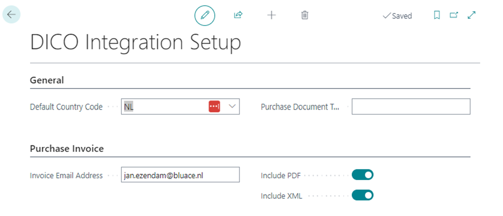
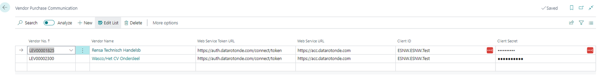
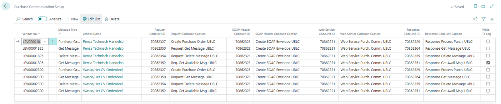
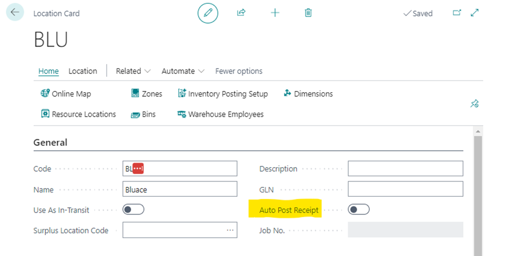

# Manual DICO Integration
This document describes how the DICO Integration app can be used to send and receive electronic order documents in Business central to and from your vendors.

## Installation and registration

### DICO Integration Setup
Before the DICO Integration app can be used, several settings must be configured. Go to the DICO Integration Setup page:

| **Default Country Code**  | **Specifies the default country code** |
| ------------- | ------------- |
| Purchase Document Type Filter  | The standard document type filter to be used when opening the inbound purchase messages page is opened. |
| Invoice Email Address  | The Continia email address where to send the mail. |
| Include PDF  | Specifies whether the email must include the PDF file. |
| Include XML  | Specifies whether the email must include the XML file. |

### Vendor Purchase Communication
In the Vendor Purchase Communication page the URL’s and authentications are configured with which messages will be sent and received regarding the vendors. This configuration fully depends on the Vendor number.

### Purchase Communication Setup
The way messages are processed within Business Central needs to be set up in the Purchase Communication Setup:

The DICO Integration app uses four message types:
*	Purchase order;
*	Get message;
*	Delete Message;
*	Get messages;

Every message type has its own Codeunit ID. The image above portrays the default values for the Codeunit ID’s as given by Bluace. Consequently, different Codeunits can be given to different vendors to specifically send or receive messages on the vendor level.

### Auto Post Receipt
For each location you can choose to directly post receipts on the specific locations. This can be of use when items are directly received on a specific location, but can’t manually be received within Business Central because a specific person doesn’t have access to Business Central and the purchase orders. The received items can therefore be received automatically when a packing document is received by Continia and allocated to the purchase order when the following configuration is set up on the location:

By going to the Location Card and enabling Auto Post Receipt, your received items will be posted automatically. If this is not of use, the packing documents will be processed with the “Qty. to Receive” field on the Lines in the purchase order.

[:arrow_left:](../README.md) [Back](../README.md)