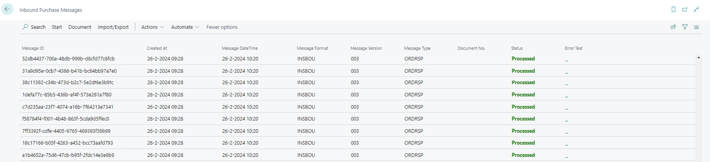
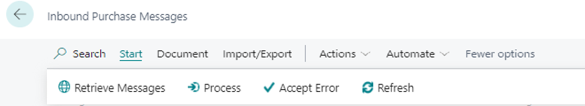
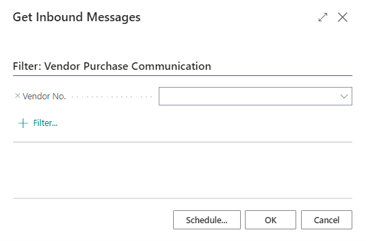
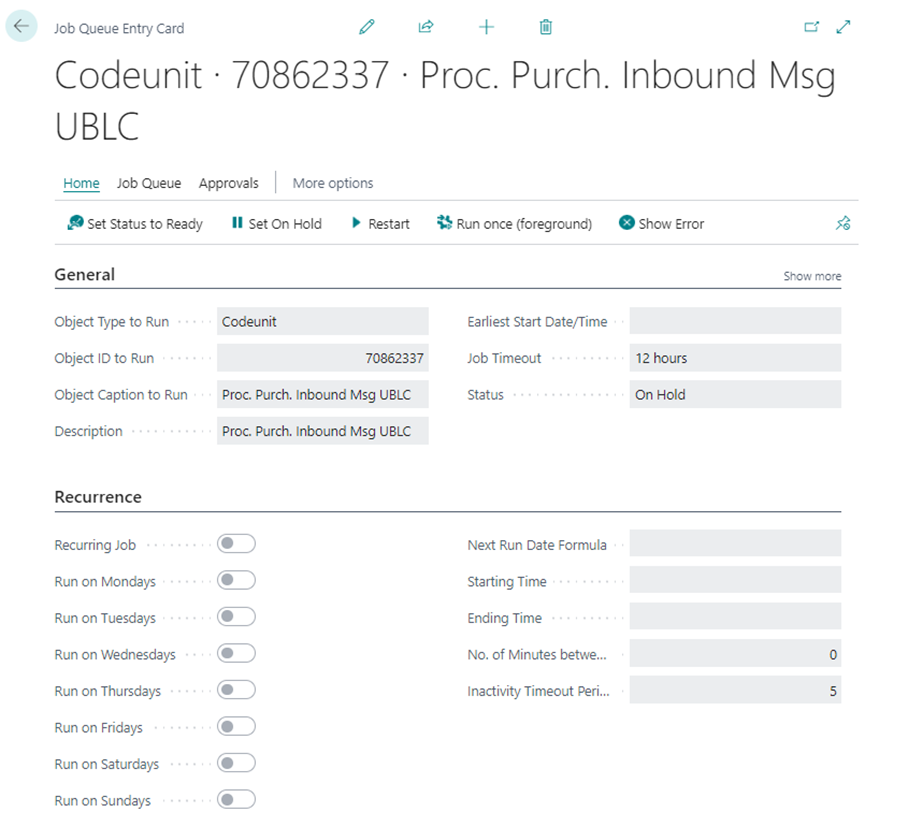

# Manual DICO Integration
This document describes how the DICO Integration app can be used to send and receive electronic order documents in Business central to and from your vendors.

## Purchase messages

### Inbound Purchase Messages
On the page Inbound Purchase Messages you can see the received messages and the result of the received message. The Status will be displayed either as Processed, Message Retrieved or Error. When an error is found, the system will always include an Error text on the line. The list has the purpose of monitoring inbound messages, for instance the errors, and to be able to adjust these errors.

The menu brings several options to process inbound messages. Messages can be retrieved manually, processed and accepted. When an error occurs, this can manually be changed to processed. Therefore, errors can be accepted.
Furthermore, under Actions, Reset Status can be found. This button recovers the previous status after a status was unintentionally changed.

Finally, the page offers you to import and export Inbound Purchase Messages.

### Get Inbound Messages
Using the page Get Inbound Messages you can manually retrieve messages, filtered on vendor. The new messages will be placed in the Purchase Messages list.

### Job Queue Entries
On the page Job Queue Entries you can periodically configure processing the purchase messages:

| **Field**  | **Description** |
| ------------- | ------------- |
| Object Type to Run  | The type of the object, report or codeunit to be run for the job queue entry. |
| Object ID to Run  | The ID of the object to be run. |
| Object Caption to Run  | Specifies whether the email must include the PDF file. |
| Description  | The description of the job queue entry. |
| Earliest Start Date/Time | The earliest date/time to run the job queue entry. |
| Job Timeout  | The maximum time that the job queue entry is allowed to run. |
| Status  | The status of the job queue entry. |

In the Job Queue Entry card, you can configure the repetition of the task for each day. The repetition can be configured in the Recurrence field on the card.

[:arrow_left:](../README.md) [Back](../README.md)